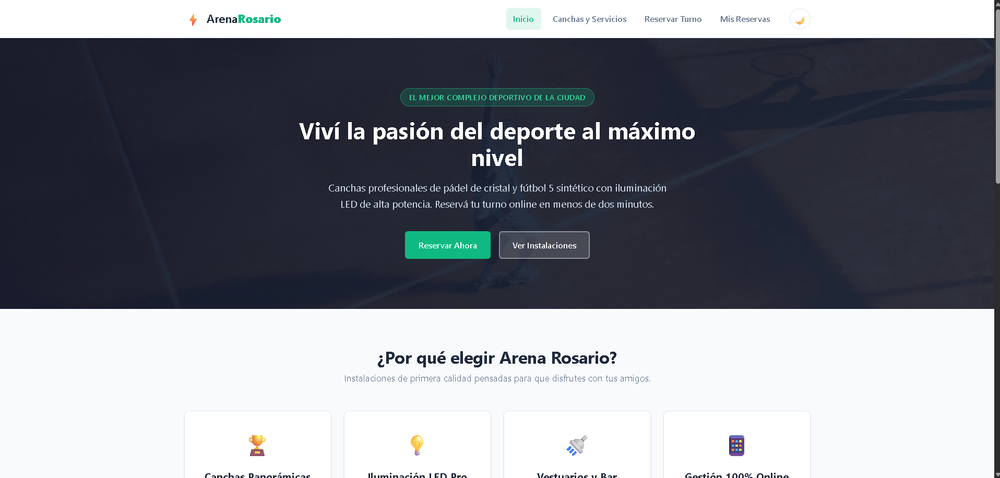
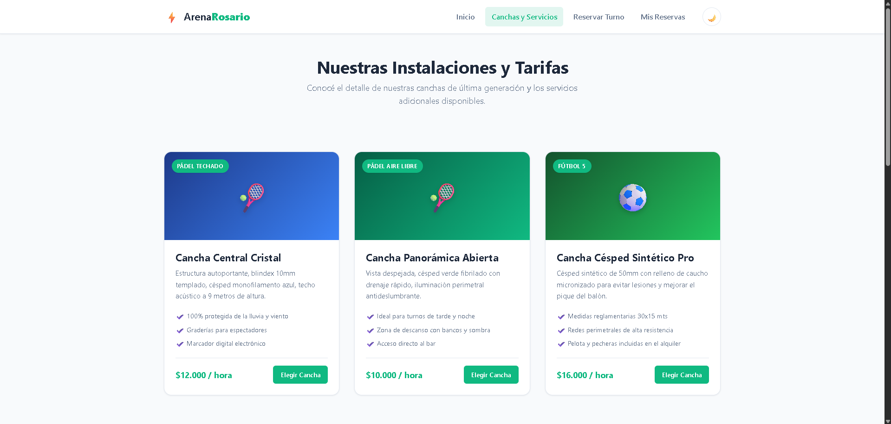
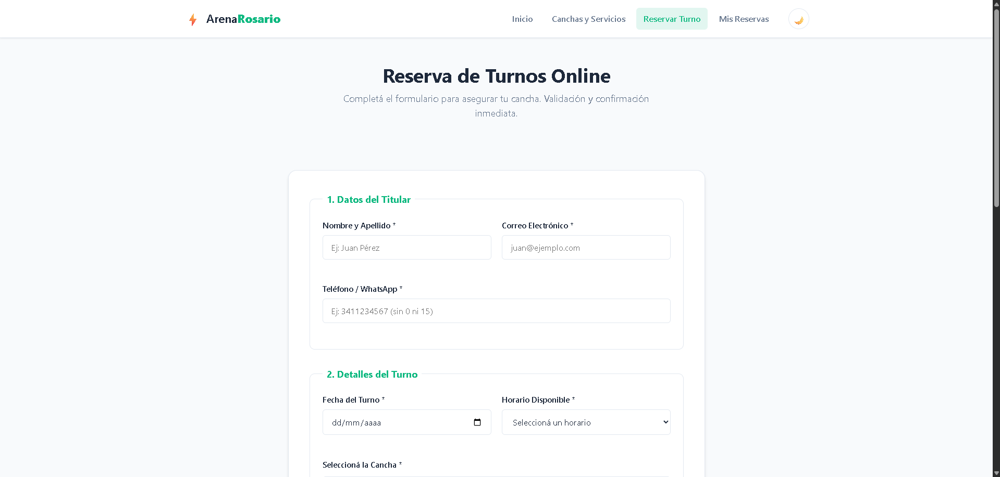
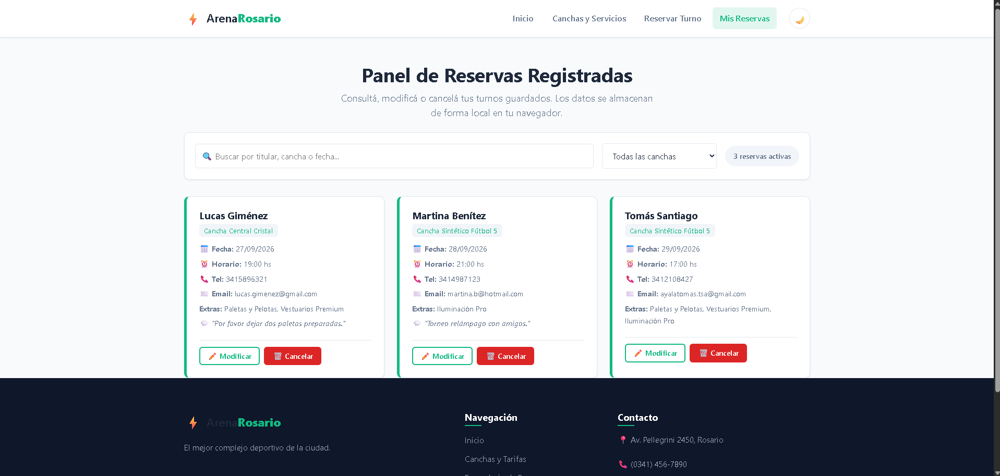

# Simulador de Reservas - Arena Rosario (Pádel & Fútbol Center)

Trabajo Práctico N° 1 para la asignatura **Programación II**  
**Tecnicatura Universitaria en Programación - UTN Facultad Regional Rosario (FRRo)**  
Ciclo Lectivo: **2026**

---

## > Integrantes del Equipo
* **Mauro Alegre** (GitHub: [@Maurit0](https://github.com/Maurit0))
* **Tomás Ayala** (GitHub: [@ayalatomas-tsa](https://github.com/ayalatomas-tsa))

---
## > Capturas de pantalla

A continuación se muestran las principales secciones de **Arena Rosario** y las funcionalidades implementadas.

### Página de Inicio



### Canchas y Servicios



### Formulario de Reserva



### Panel de Reservas


---

## > Descripción del Proyecto
**Arena Rosario** es una aplicación web frontend interactiva orientada a la reserva y gestión de turnos para un complejo deportivo de canchas de pádel panorámicas y fútbol 5 sintético.

El sistema fue diseñado bajo una arquitectura limpia y modular de **4 páginas HTML semánticas**, maquetado **exclusivamente con CSS3 nativo (Flexbox y CSS Grid)** sin frameworks externos, y con una capa de lógica en **JavaScript (ES6+)** que implementa validación de formularios en tiempo real y persistencia completa de datos mediante la API `localStorage` (simulando un backend local).

---

## > Tecnologías y Estándares Utilizados
* **HTML5 Semántico:** Uso exhaustivo de `<header>`, `<nav>`, `<main>`, `<section>`, `<article>`, `<aside>`, `<address>` y `<footer>`.
* **CSS3 Nativo:** Maquetación combinada con **CSS Grid** (grilla de canchas, footer y layout) y **Flexbox** (navegación, tarjetas de beneficios y controles de formulario).
* **Responsive Web Design:** 3 puntos de quiebre (*breakpoints*) para Desktop (>1024px), Tablet (768px a 1023px) con menú hamburguesa colapsable animado, y Mobile (<480px) con reordenamiento en stack vertical.
* **JavaScript ES6+:** Manipulación del DOM mediante `querySelector` y `querySelectorAll`, delegación de eventos con `.closest()`, funciones flecha, template literals, expresiones regulares (RegEx) y desestructuración.
* **Almacenamiento Local (Web Storage API):** Persistencia en `localStorage` con serialización y deserialización a través de `JSON.stringify()` y `JSON.parse()`.
* **Control de versiones:** Git y GitHub con flujo de trabajo distribuido y commits atómicos por integrante.

---

## > Funcionalidades Implementadas

### 1. Navegación y Páginas del Sitio
1. **`index.html` (Inicio):** Landing page con Hero Banner, llamado a la acción (CTA), sección de beneficios y presentación de canchas disponibles.
2. **`pages/servicios.html` (Instalaciones y Tarifas):** Catálogo técnico con precios, servicios adicionales y componente de **Preguntas Frecuentes (FAQ)** interactivo con efecto acordeón.
3. **`pages/reservar.html` (Formulario Avanzado):** Formulario con 8 campos de distintos tipos (`text`, `email`, `tel`, `date`, `select`, `radio group`, `checkbox group`, `textarea`).
4. **`pages/mis-reservas.html` (Panel de Gestión CRUD):** Visualización en vivo de turnos registrados, buscador en tiempo real, filtro por cancha y contador dinámico.

### 2. Validaciones en Tiempo Real y Validación Cruzada
* **Nombre y Apellido:** Validación mediante RegEx (`/^[a-zA-ZáéíóúÁÉÍÓÚñÑ\s]{3,50}$/`).
* **Email:** Validación de formato estándar de correo electrónico.
* **Teléfono:** Validación de longitud y formato numérico (8 a 12 dígitos).
* **Fecha:** Control temporal que impide reservar en fechas anteriores al día actual.
* **Validación Cruzada (Anti Doble Turno):** Al elegir fecha, horario y cancha, el sistema verifica en `localStorage` si ese turno ya está ocupado, advirtiendo al usuario antes de enviar el formulario.
* **Feedback Visual:** Bordes verdes/rojos dinámicos con íconos vectoriales SVG y mensajes contextuales de error o confirmación.

### 3. Simulación de Backend con `localStorage` (CRUD Completo)
* **Create (Crear):** Al confirmar el turno en el formulario, se crea un objeto con ID único (timestamp) y se almacena en el array de reservas de `localStorage`.
* **Read (Leer):** Las reservas se leen dinámicamente y se renderizan en tarjetas informativas con fechas formateadas y lista de extras.
* **Update (Editar):** Ventana modal interactiva que permite modificar el titular, la fecha, el horario y la cancha de cualquier turno existente con validación cruzada.
* **Delete (Eliminar):** Botón para cancelar reservas con confirmación previa y eliminación inmediata tanto del DOM como del almacenamiento local.

### 4. Extras y Desafíos Adicionales
* **Modo Oscuro / Claro persistente:** Toggle de tema con ícono animado que recuerda la preferencia del usuario en `localStorage` entre sesiones.
* **Buscador y Filtrado en Vivo:** Filtrado reactivo en el evento `input` que busca simultáneamente por titular, cancha o fecha.
* **Precarga de Datos Iniciales (Demo):** Si el navegador no tiene reservas previas, el sistema carga automáticamente dos turnos de prueba para facilitar la corrección y evaluación del docente.

---

## > Instrucciones para Ejecutar el Proyecto
1. Clonar el repositorio público:
   ```bash
   git clone https://github.com/Maurit0/Tp_programacionII_reservas.git
   ```
2. Acceder al directorio:
   ```bash
   cd Tp_programacionII_reservas
   ```
3. Abrir en **Visual Studio Code**.
4. Iniciar mediante la extensión **Live Server** (haciendo clic derecho en `index.html` > *Open with Live Server*), o abrir directamente el archivo `index.html` en Google Chrome, Mozilla Firefox o Microsoft Edge.

---

## > Estructura del Repositorio
```text
/
├── .gitignore
├── README.md
├── index.html
├── pages/
│   ├── servicios.html
│   ├── reservar.html
│   └── mis-reservas.html
├── css/
│   ├── base.css
│   ├── layout.css
│   ├── components.css
│   └── form.css
├── js/
│   ├── main.js
│   ├── validaciones.js
│   └── reservasCrud.js
└── assets/
    └── icons/
        └── favicon.svg
```
